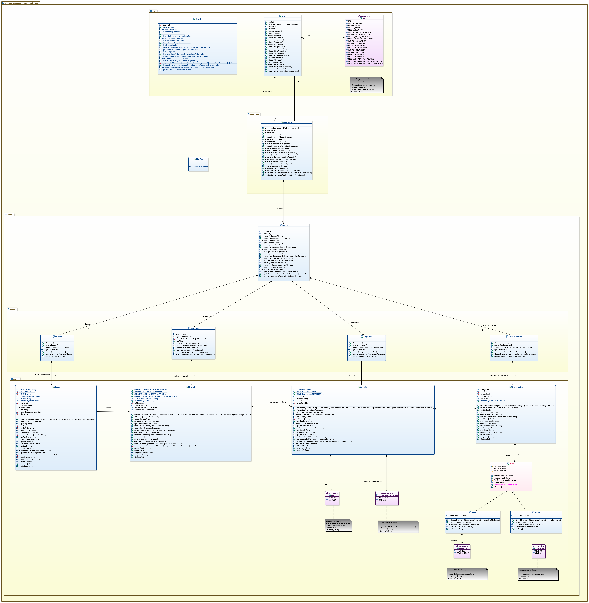

# Tarea: Sistema de Matriculación
## Profesor: Andrés Rubio del Río
## Alumno: Tesifón Linares Bonilla_v3

Ahora que ya tienes afianzados los conceptos básicos de la Programación Orientada a Objetos, es un buen momento para llevar a cabo algunas modificaciones que afectan al modelo diseñado ya que hay conceptos avanzados de la Programación Orientada a Objetos que aún no han sido vistos en las unidades anteriores y que deberían ser aplicados. Por tal motivo, en este cuarto spring se van a llevar a cabo una serie de modificaciones con las que se pretende mejorar el diseño de clases implementado hasta ahora.

Para ello te muestro un diagrama de clases para el mismo y poco a poco te iré explicando los diferentes pasos a realizar:

###Primeros Pasos

Clona la versión anterior del proyecto a un nuevo repositorio SistemaMatriculacion_v3. Realiza las diferentes modificaciones que se piden en esta tarea.
Realiza tu primer commit.

###Opción

Modifica el enum Opcion teniendo en cuenta lo siguiente:

Añade un atributo estático de tipo Vista. Implementa el método setVista tal y como aparece en el diagrama de clases y que deberá ser llamado desde el constructor de la clase Vista.

Añade el método abstracto ejecutar, que deberá ser implementado en cada instancia del enum Opcion, llamando al método que le corresponda de la clase Vista. Con esto se pretende que cada opción no solo contenga el mensaje que debe mostrarse por pantalla, sino también, el método de la clase Vista que debe ser ejecutado cuando el usuario de la aplicación elija dicha opción.

Realiza el commit correspondiente.

###Modalidad 

Crea el Enum Modalidad tal y como aparece en el diagrama de clases para que se pueda elegir entre modalidad Presencial y modalidad Semipresencial.
Añade los métodos y atributos necesarios para que la implementación del Enum se ajuste a lo mostrado en el diagrama de clases.
Realiza el commit correspondiente.

###TiposGrado 

Crea el Enum TiposGrado tal y como aparece en el diagrama de clases para que se pueda elegir entre Grado.
Añade los métodos y atributos necesarios para que la implementación del Enum se ajuste a lo mostrado en el diagrama de clases.
Realiza un commit con la modificación de este enumerado.

###Grado

Crea la clase Grado para que se ajuste a lo mostrado en el diagrama de clases.
Añade los atributos necesarios con el modificador correspondiente según se muestra en el diagrama de clases.
Implementa los métodos getNombre y setNombre, teniendo en cuenta que este último deberá lanzar las excepciones correspondientes en caso de que el parámetro no sea el adecuado.
Implementa el método setIniciales que establecerá el atributo iniciales el cual se genera cogiendo el primer carácter de cada palabra del nombre del Grado. Además, deberá estar todo en mayúsculas. Ten en cuenta que cada vez que se modifique el nombre del grado, deberá actualizarse el atributo iniciales al valor que le corresponda.
Implementa el método toString que devolverá una cadena de acuerdo al siguiente formato: (iniciales) - nombre.
Crea el método setNumAnios.
Realiza un commit con la clase creada.

###GradoD

Crea la clase GradoD para que se ajuste a lo mostrado en el diagrama de clases.
Añade los atributos necesarios con el modificador correspondiente según se muestra en el diagrama de clases.
Implementa los métodos getters y setters necesarios teniendo en cuenta que estos últimos deberán validar el parámetro y lanzar la excepción que corresponda. Debes tener en cuenta que el número de años de los grados de este tipo será 2 o 3.
Realiza un commit con la clase creada.

###GradoE

Crea la clase GradoE para que se ajuste a lo mostrado en el diagrama de clases.
Añade los atributos necesarios con el modificador correspondiente según se muestra en el diagrama de clases.
Implementa los métodos getters y setters necesarios teniendo en cuenta que estos últimos deberán validar el parámetro y lanzar la excepción que corresponda. Debes tener en cuenta que el número de años de los grados de este tipo será siempre 1.
Realiza un commit con la clase creada.

###Consola

Crea el método leerTipoGrado que permitirá al usuario elegir un tipo de Grado (Grado D o Grado E).
Crea el método leerModalidad que permitirá al usuario elegir el tipo de modalidad de un grado (Presencial o Semipresencial).
Modifica el método leerGrado para que en función del tipo de grado del Ciclo Formativo elegido por el usuario, cree el objeto correspondiente (Grado D o Grado E) con los atributos necesarios.
Modifica el método leerCicloFormativo para haga uso del método nuevo método leerGrado.
Modifica los métodos getCicloFormativoPorCodigo y getAsignaturaPorCodigo para que los errores de compilación sean corregidos.
Realiza un commit con la nueva clase creada.
Finalmente, realiza el push hacia tu repositorio remoto en GitHub.

###Se valorará:

La indentación debe ser correcta en cada uno de los apartados.
El nombre de las variables debe ser adecuado.
Se debe utilizar la clase Entrada para realizar la entrada por teclado.
El programa debe pasar todas las pruebas que van en el esqueleto del proyecto y toda entrada del programa será validada, para evitar que el programa termine abruptamente debido a una excepción.
La corrección ortográfica tanto en los comentarios como en los mensajes que se muestren al usuario.